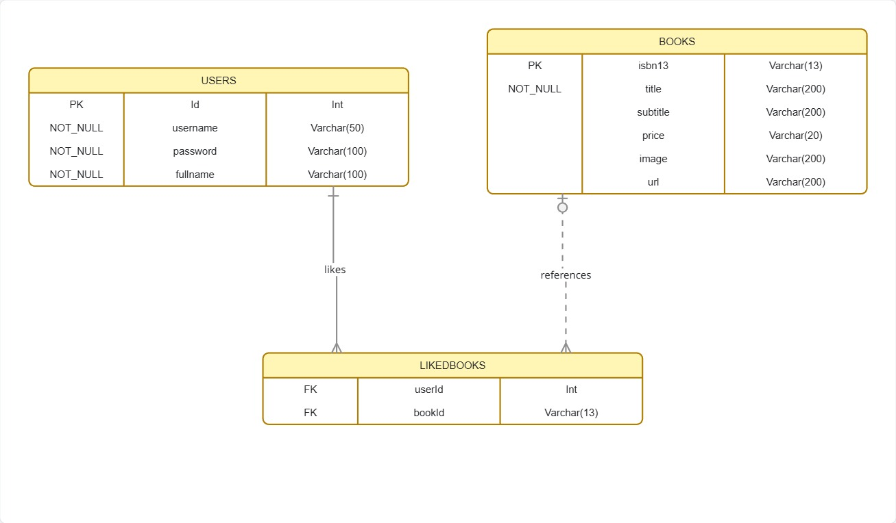

## 💻homeproBackEndtest

# ItBookShop API

⚙️ Setup Instructions
1️⃣ Clone Project
```
git clone <your-repository-url>
cd ItBookShop
```
2️⃣ Install EF Core Tool (Version 8)
```
dotnet tool install --global dotnet-ef --version 8.*
```
3️⃣ Create Database
```
dotnet ef migrations add InitialCreatea
dotnet ef database update
```
4️⃣ Run Application
```
dotnet clean
dotnet build
dotnet run
```
---

# 🚀 Tech Stack

```
.NET 8
ASP.NET Core Web API
Entity Framework Core 8
SQLite
External API (ITBook Store API)
Postman (Testing)
```


---

# 📋 Project

Presentation → Controllers (API Layer)</br>
Application  → DTOs / Business Logic</br>
Domain → Entities (User, Book, LikedBook)</br>
Infrastructure  → DbContext, Database, External API</br>

---

# 📂 Project Structure

* ItBookShop
* Controllers
  * UserController.cs
  * BooksController.cs
  * AuthController.cs
* Models
  * User.cs
  * Book.cs
  * LikedBook.cs

* Data
  * AppDbContext.cs

* Program.cs

---

🗄 Database Design (ERD)



---


## 🗂 Database Tables Overview

โปรเจกต์นี้ประกอบด้วย 3 ตารางหลัก ได้แก่:

* `Users`
* `Books`
* `LikedBooks`

---

## 🔹 Users Table

เก็บข้อมูลผู้ใช้งานระบบ

| Column   | Type   | Description |
|----------|--------|------------|
| Id       | int    | Primary Key |
| Username | string | Username |
| Password | string | Password |
| Fullname | string | Full Name |


---

## 🔹 Books Table

เก็บข้อมูลหนังสือจาก API ภายนอก 

| Column   | Type   |
|----------|--------|
| Id       | int    |
| Isbn13   | string |
| Title    | string |
| Subtitle | string |
| Price    | string |
| Image    | string |
| Url      | string |

---

## 🔹 LikedBooks Table

เก็บรายการหนังสือที่ผู้ใช้กดถูกใจ (Favorite / Like)

| Column | Type | Description |
|--------|------|------------|
| Id     | int  | Primary Key |
| UserId | int  | Foreign Key → Users |
| BookId | string | ISBN13 |
| Title  | string | Book Title |
| Image  | string | Book Image URL |


---

## 🔗 Relationships

* `Users (1) —— (Many) LikedBooks`
* `Books` ใช้ `Isbn13` เป็นตัวอ้างอิงสำหรับการกด Like

---


# 🌍 External API Integration

Used API:

**Search:**

* `GET https://api.itbook.store/1.0/search/mysql`


**Book Detail:**

* `GET https://api.itbook.store/1.0/books/{isbn13}`

---


